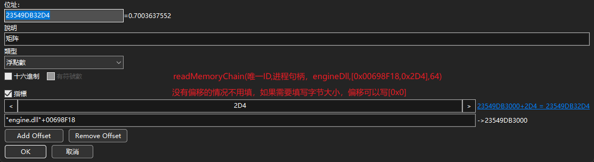
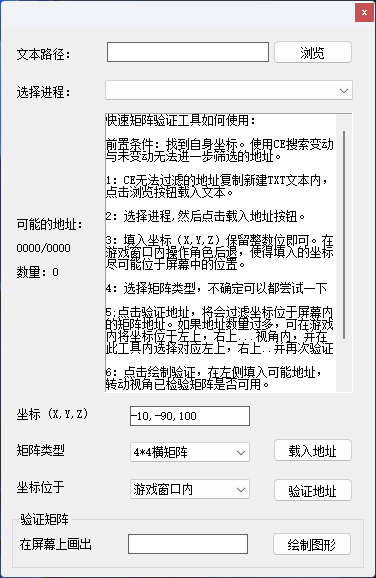
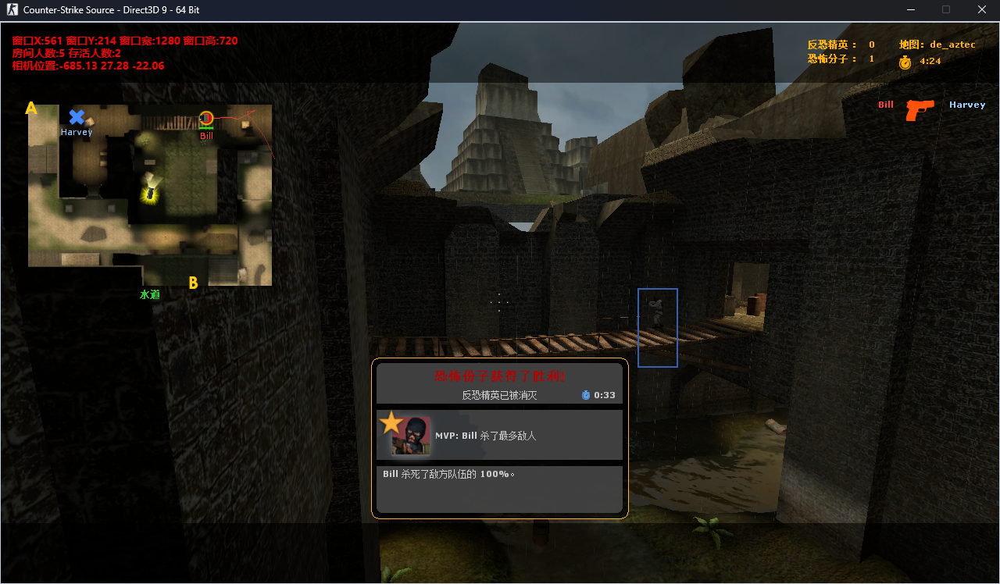

# 说明


`本项目使用 Tauri + Vue + TypeScript创建`

`⭐ 鉴于大部分学习者的需要将测试游戏的CE工程文件放置项目内`


使用 Vue 前端和 Rust 后端打造 FPS 透视
前端使用 `pixi.js` 进行绘制
后端封装内存读取工具，前端快速编写代码无需重启调试
Vue 前端与后端实时通讯获取内存数据并在前端渲染


## 运行命令
```bash
    # 安装依赖
	pnpm i

    # 运行项目
    pnpm tauri run
```

hack.ts 可用函数

```ts
findPidByName(进程名) // 通过进程名来查找进程pid

findProcessHandleByPid(进程PID) // 通过进程pid获取进程句柄

findWinhwndByPid(进程PID) // 通过进程pid查找主窗口句柄

findModuleBaseAddressByPid(进程PID,模块名) // 通过进程pid和模块名获取模块基址

getWindowInfoByWinhwnd(窗口句柄) // 通过窗口句柄获取窗口信息（通过Socket返回值）

readMemoryChain(唯一ID,进程句柄,内存地址,[偏移数组],数据大小) // 读取内存+多层偏移（通过Socket返回值）


worldToScreen(世界坐标,相机矩阵,窗口信息) // 世界坐标转屏幕坐标

```


#### readMemoryChain函数使用 示例图片


### 感谢以下作者

#### 快速查找矩阵工具 `非常推荐 ⭐⭐⭐⭐⭐`


作者B站主页:https://space.bilibili.com/73296699 哈呢猪




### 游戏测试效果


### TODO
1.  ~~高频实时的数据通过WebSocket双向传输~~
2.  ~~WebSocket连接中断自动重连~~
3.  ~~通过进程名来查找进程pid~~
4.  ~~通过进程pid获取进程句柄~~
5.  ~~通过进程pid查找主窗口句柄~~
6.  ~~通过进程pid和模块名获取模块基址~~
7.  ~~支持读取64位程序内存~~
8.  ~~hack库添加内存偏移函数~~
9.  ~~hack库添加新的读取内存函数，支持快速偏移读取内存~~

### 作者声明
#### [仅供学习 请勿非法用途 从事非法用途出现任何问题与作者无关]
